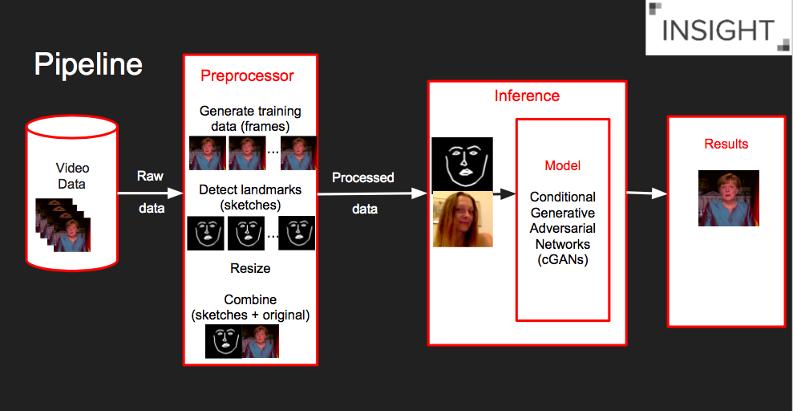
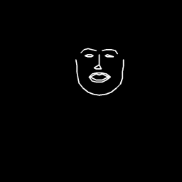
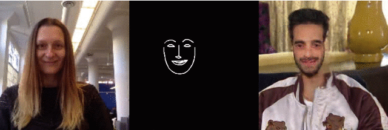
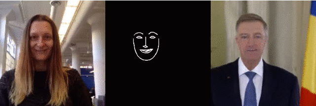

# facial_expression_transfer

This is a pix2pix demo that learns from facial landmarks and translates this into a face. A webcam-enabled application is also provided that translates your face to the trained face in real-time.

This project comes in three repositories. This repository, for general purpose scripts and documentation, and a forked version of the [face2face](https://github.com/datitran/face2face-demo) and [pix2pix-tensorflow](https://github.com/affinelayer/pix2pix-tensorflow)  repositories added as submodules. The presentation slides for this project are provided as [Google Slides](https://bit.ly/2TzdxPB).

<p align='center'>  
    
</p>

## Getting Started

### 1. Prepare Environment

- Clone this repository recursively to include the two forked repositories mentioned above.
```
git clone https://github.com/alina1021/facial_expression_transfer.git --recursive
cd facial_expression_transfer
```

- Create the conda environment from file (Mac OSX)
```
conda env create -f environment.yml
# activate this environment
conda activate facial_expression_transfer
```
### 2. Generate Training Data

```
cd face2face-demo
python generate_train_data.py --file ../iohannis_christmas_speech.mp4 --num 400 --landmark-model ../shape_predictor_68_face_landmarks.dat
```

Input:

- `file` is the name of the video file from which you want to create the data set.
- `num` is the number of train data to be created.
- `landmark-model` is the facial landmark model that is used to detect the landmarks. A pre-trained facial landmark model is provided [here](http://dlib.net/files/shape_predictor_68_face_landmarks.dat.bz2).

Output:

- Two folders `original` and `landmarks` will be created.

If you want to download this dataset, here is also the [video file](https://drive.google.com/file/d/1JGN6uulKeRS6adWbRHmIDaWKcrmKyRKq/view?usp=sharing) that I used and the generated [training dataset](https://drive.google.com/file/d/1KXfM_aC5GCRFKYls62r_sEpHV6nipOW-/view?usp=sharing) (400 images already split into training and validation).

### 3. Train Model

```
cd ..
# Move the original and landmarks folder into the pix2pix-tensorflow folder
mkdir pix2pix-tensorflow/photos
mv face2face-demo/original pix2pix-tensorflow/photos/original
mv face2face-demo/landmarks pix2pix-tensorflow/photos/landmarks
rm -rf face2face-demo/landmarks

# Go into the pix2pix-tensorflow folder
cd pix2pix-tensorflow/

# Resize original images
python tools/process.py \
  --input_dir photos/original \
  --operation resize \
  --output_dir photos/original_resized

# Resize landmark images
python tools/process.py \
  --input_dir photos/landmarks \
  --operation resize \
  --output_dir photos/landmarks_resized

# Combine both resized original and landmark images
python tools/process.py \
  --input_dir photos/landmarks_resized \
  --b_dir photos/original_resized \
  --operation combine \
  --output_dir photos/combined

# Split into train/val set
python tools/split.py \
  --dir photos/combined

# Train the model on the data
python pix2pix.py \
  --mode train \
  --output_dir face2face-model \
  --max_epochs 200 \
  --input_dir photos/combined/train \
  --which_direction AtoB
```

### 4. Test Model / Validation

Testing is done with `--mode test`. You should specify the checkpoint to use with `--checkpoint`, this should point to the output_dir that you created previously with `--mode` train:

```
# test the model
python pix2pix.py \
  --mode test \
  --output_dir face2face_test \
  --input_dir photos/combined/val \
  --checkpoint face2face-model
```

The testing mode will load some of the configuration options from the checkpoint provided so you do not need to specify which_direction for instance.

The test run will output an HTML file at face2face_test/index.html that shows input/output/target image sets like the following:



For more information around training and testing, have a look at Christopher Hesse's [pix2pix-tensorflow](https://github.com/affinelayer/pix2pix-tensorflow) implementation.

### 5. Export Model

1. First, we need to reduce the trained model so that we can use an image tensor as input:
    ```
    python ../face2face-demo/reduce_model.py --model-input face2face-model --model-output face2face-reduced-model
    ```

    Input:

    - `model-input` is the model folder to be imported.
    - `model-output` is the model (reduced) folder to be exported.

    Output:

    - It returns a reduced model with less weights file size than the original model.

2. Second, we freeze the reduced model to a single file.
    ```
    python ../face2face-demo/freeze_model.py --model-folder face2face-reduced-model
    ```

    Input:

    - `model-folder` is the model folder of the reduced model.

    Output:

    - It returns a frozen model file `frozen_model.pb` in the model folder.

### 6. Run Demo

```
cd ../face2face-demo

# run webcam
python run_webcam.py --source 0 --show 1 --landmark-model ../shape_predictor_68_face_landmarks.dat --tf-model ../pix2pix-tensorflow/face2face-reduced-model/frozen_model.pb

# run recorded video
python run_video.py --source ../my_video.mov --show 1 --landmark-model ../shape_predictor_68_face_landmarks.dat --tf-model ../pix2pix-tensorflow/face2face-reduced-model/frozen_model.pb
```

Input:

- `source` is the device index of the camera (default=0).
- `show` is an option to either display the normal input (0) or the normal input and the facial landmark (1) alongside the generated image (default=0).
- `landmark-model` is the facial landmark model that is used to detect the landmarks.
- `tf-model` is the frozen model file.


## Models

### Gianina Alina Negoita - Maluma 256x256

Me, my face and output:



Pre-trained frozen model [here](https://drive.google.com/file/d/1FZ1RL9BCIulKMrX_v2hicYLv80SB55ws/view?usp=sharing). This model is trained on 400 images with epoch 200.

### Gianin Alina Negoita - Klaus Iohannis 256x256

Me, my face and output:



Frozen model can be downloaded from [here](https://drive.google.com/file/d/1C5bN5J6_W9Zxs304nMyFiByieqbH-w_J/view?usp=sharing). This model is trained on 400 images with epoch 200.

## Requirements
- [Anaconda / Python 3.5](https://www.continuum.io/downloads)
- [TensorFlow 1.2](https://www.tensorflow.org/)
- [OpenCV 3.0](http://opencv.org/)
- [Dlib 19.4](http://dlib.net/)

## Acknowledgments

Thanks to [Dat Tran](http://www.dat-tran.com/) for inspiration, code and model! 

For training and testing, thanks to Christopher Hesse for [Image-to-Image Translation in Tensorflow](https://affinelayer.com/pix2pix/) code and examples.

Thanks also to Phillip Isola<sup>1</sup>, Jun-Yan Zhu<sup>1</sup>, Tinghui Zhou<sup>1</sup>, and Alexei A Efros<sup>1</sup> for their fantastic work on [Image-to-Image Translation Using Conditional Adversarial Networks](https://arxiv.org/pdf/1611.07004v1.pdf). 

<sup>1</sup> Berkeley AI Research (BAIR) Laboratory, University of California, Berkeley

## Copyright

This project is licensed under the MIT License - see the [LICENSE](LICENSE) file for details and the license of the other projects used within this repository.

